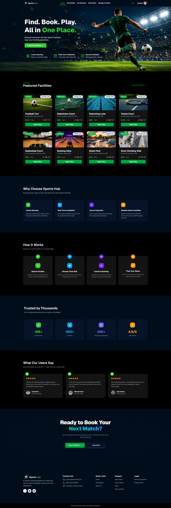

# 🏆 Sports Hub – Sports Facility Booking Management System

A modern full-stack sports facility booking platform built with the **MERN Stack**, **Next.js 16**, and **Better Auth**. Users can explore sports facilities, view details, search and filter facilities, and book available time slots seamlessly.


## 🌐 Live URL

🔗 **Live Site:** https://sports-hub-tawny.vercel.app


## 📌 Purpose

**Sports Hub** is a real-world sports reservation platform designed to simplify the process of discovering and booking sports facilities.

The platform allows users to:

* Explore available sports facilities
* Search and filter facilities by name or type
* View detailed facility information
* Book facilities for specific dates and time slots
* Manage their own listed facilities
* Authenticate securely using Email/Password or Google Sign-In

The project demonstrates modern full-stack web development practices including authentication, authorization, protected routes, API security, responsive UI design, and database management.

---

## ✨ Features

### 🎨 User Interface

* Pixel-perfect modern UI
* Fully responsive design for mobile, tablet, and desktop
* Interactive hero section with Framer Motion animations
* Beautiful homepage layout
* Featured facilities showcase section
* Light and Dark theme support
* Theme persistence using Context API and Local Storage

### 🏟 Facility Management

* Browse all available sports facilities
* Search facilities by facility name
* Filter facilities by facility type
* Detailed facility information page
* View pricing, capacity, location, and available slots

### 🔐 Authentication & Authorization

* Secure authentication with Better Auth
* Email & Password Sign Up / Sign In
* Google Authentication
* JWT-based authentication
* Protected routes using Next.js Proxy
* Persistent user sessions

### 📅 Booking System

* Book facilities for specific dates
* Select preferred time slots
* Hour-based booking system
* Real-world reservation workflow

### 👤 User Dashboard Features

Authenticated users can:

* Add new facilities
* View their own facilities
* Update facility information
* Delete facilities
* Manage facility listings

### ⚙ Backend & Security

* Express.js REST API
* MongoDB database integration
* Protected API endpoints
* JWT verification using JOSE
* Secure environment variables using dotenv
* More than 10 custom REST API endpoints
* Role-based route protection
* Secure data handling

---

## 🛠 Tech Stack

### Frontend

* Next.js 16.2.4
* React 19.2.4
* JavaScript
* Tailwind CSS v4
* DaisyUI
* Better Auth
* Framer Motion
* React Icons
* Lucide React
* React Toastify

### Backend

* Node.js
* Express.js
* MongoDB
* JOSE (JWT Verification)
* CORS
* Dotenv

---

## 📦 NPM Packages Used

### Frontend Dependencies

```bash
@better-auth/mongo-adapter
better-auth
daisyui
framer-motion
lucide-react
mongodb
next
react
react-dom
react-icons
react-toastify
```

### Backend Dependencies

```bash
cors
dotenv
express
jose
mongodb
```

---

## 🚀 Installation & Setup

### Clone Repository

```bash
git clone https://github.com/ZunaidChowdhury/sports-hub.git
cd sports-hub
```

### Install Frontend Dependencies

```bash
npm install
```

### Create Environment Variables

Create a `.env.local` file:

```env
NEXT_PUBLIC_BASE_URL=
NEXT_PUBLIC_SERVER_BASE_URL=

BETTER_AUTH_SECRET=
BETTER_AUTH_URL=

MONGODB_URI=

GOOGLE_CLIENT_ID=
GOOGLE_CLIENT_SECRET=
```

### Run Frontend

```bash
npm run dev
```

---

## Backend Setup

```bash
git clone https://github.com/ZunaidChowdhury/sports-hub-server.git
cd sports-hub-server
npm install
```

Create a `.env` file:

```env
PORT=
MONGODB_URI=
CLIENT_URL="
```

Run the server:

```bash
npm start
```

---

## 🔒 Security Features

* Better Auth Authentication
* Google OAuth Login
* JWT-based Authorization
* Protected API Endpoints
* Protected Client Routes
* Environment Variable Protection
* Secure Token Verification with JOSE
* User-Specific Resource Access Control

---

## 🎯 Future Improvements

* Payment Gateway Integration
* Facility Reviews & Ratings
* Admin Dashboard
* Booking Cancellation System
* Email Notifications
* Facility Availability Calendar
* Real-Time Booking Updates

---

## 👨‍💻 Author

**Zunaid Chowdhury**

Full Stack MERN & Next.js Developer

📧 [programmer.zunaid@gmail.com](mailto:programmer.zunaid@gmail.com)

---


## 📸 Screenshot
<div align="center">
  
</div>